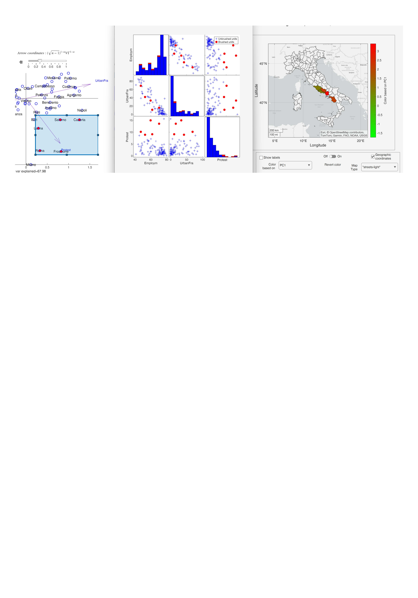

# Interactive Graphics for PCA in MATLAB
**Marco Riani**1*, **Anthony C. Atkinson**2, **Aldo Corbellini**1* , **Domenico Perrotta**3*, **Francesca Torti**3* and **Gianluca Morelli**1

1 Department of Economics and Management and Interdepartmental Research Centre for Robust Statistics

2 London School of Economics

3 EC Joint Research Centre (JRC)

<table>
  <tr>
    <td></td>
  </tr>
</table>

# Abstract
Principal Component Analysis (PCA) is a fundamental tool for dimension
reduction and exploratory analysis of multivariate data, yet standard
implementations often provide limited support for interactive
visualization, robust inference, and integrated outlier detection. In
this paper we present a comprehensive set of MATLAB routines within the
FSDA (Flexible Statistics and Data Analysis) toolbox that extend
classical PCA through interactive and dynamic graphical methods, with
particular emphasis on biplots, robustness, and linked visualizations.
The proposed tools allow users to explore PCA results in two and three
dimensions, dynamically adjust biplot scaling parameters, visualize
confidence regions, and assess the impact of outliers using hard-trimming
approaches such as the Minimum Covariance Determinant and the Forward
Search. Brushing and linking techniques connect PCA representations with
scatter plot matrices and geographical maps, enabling substantive
interpretation of complex data structures. The methodology is illustrated
through an analysis of quality-of-life indicators for Italian provinces,
showing how interactive graphics reveal latent structure, geographical
patterns, and atypical observations that are difficult to detect using
static plots alone. The paper demonstrates how modern interactive
visualization substantially enhances the interpretability and robustness
of PCA analyses. 

---

## Requirements

- **MATLAB** R2025b or later.

- **MathWorks toolboxes**:                  
    - Mapping Toolbox                        
    - Image Processing Toolbox             
    - Statistics and Machine Learning Toolbox
    - Parallel Computing Toolbox            
    - Text Analytics Toolbox                
- **FSDA toolbox**, version `8.7.11.0` or later.
  Install it in one of the following ways:
  - from the MATLAB Add-On Explorer (search for "FSDA");
  - from the [MathWorks File Exchange](https://www.mathworks.com/matlabcentral/fileexchange/72999-fsda);
  - from [GitHub](https://github.com/UniprJRC/FSDA).

No commercial license is required to run the material on MATLAB Online, all the required MathWorks toolboxes are already present, what is needed is the creation of a free account: clicking the **Open in MATLAB Online** badge below runs everything in the browser using the free version of MATLAB Online.

## How to reproduce the results
Run the file [`replication.m`](https://github.com/UniprJRC/PCAinteractive/blob/main/replication.m), which reproduces the analyses and launches the graphical displays used in the paper.

The interactive features described in the paper (brushing, linking, dynamic updating of the plots) require a MATLAB desktop or MATLAB Online session; they are not available when the code is executed in batch mode.

The `extra/` directory contains the earlier figure-specific scripts and notebooks, retained only as optional teaching and inspection material.

